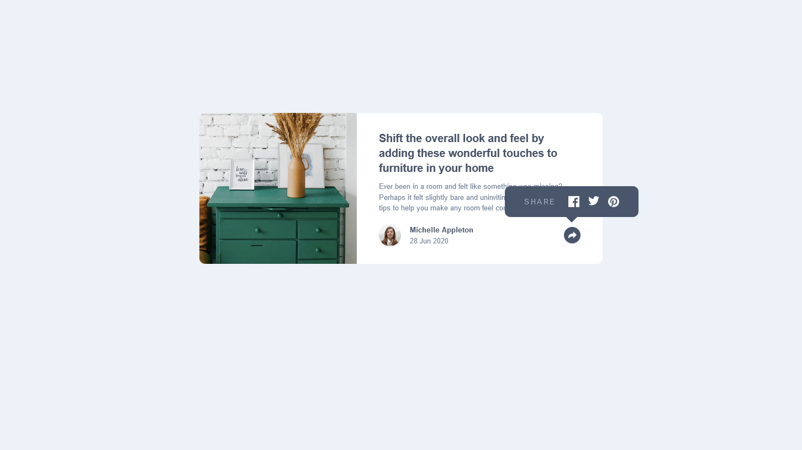
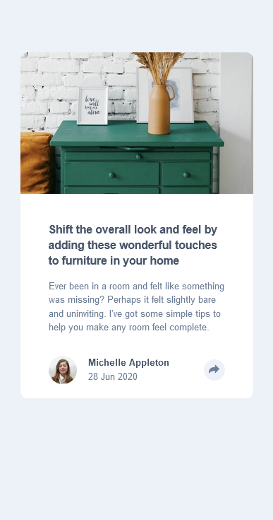

# Frontend Mentor - Article preview component solution

This is a solution to the [Article preview component challenge on Frontend Mentor](https://www.frontendmentor.io/challenges/article-preview-component-dYBN_pYFT).

## Table of contents

- [Overview](#overview)
  - [The challenge](#the-challenge)
  - [Screenshot](#screenshot)
  - [Links](#links)
- [My process](#my-process)
  - [Built with](#built-with)
  - [Continued development](#continued-development)
- [Author](#author)

## Overview

### The challenge

Users should be able to:

- View the optimal layout for the component depending on their device's screen size
- See the social media share links when they click the share icon

### Screenshot

### Links

- Solution URL: [https://github.com/Targitay2012/Article-preview-component](https://github.com/Targitay2012/Article-preview-component)
- Live Site URL: [https://targitay2012.github.io/Article-preview-component/](https://targitay2012.github.io/Article-preview-component/)

## My process

### Built with

- Semantic HTML5 markup
- CSS custom properties
- Flexbox
- SCSS
- JQuery

### Continued development

I continue to improve in HTML, CSS, JS

## Author

- Frontend Mentor - [@Targitay2012](https://www.frontendmentor.io/profile/Targitay2012)