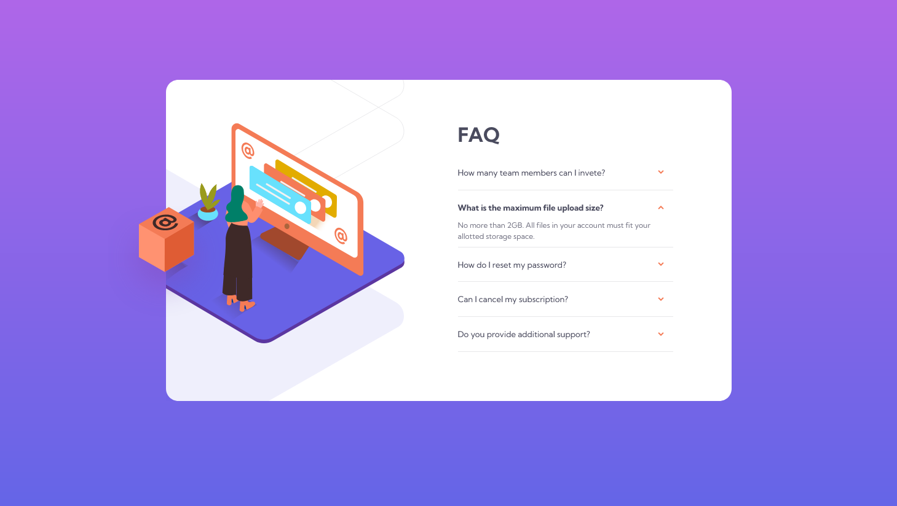
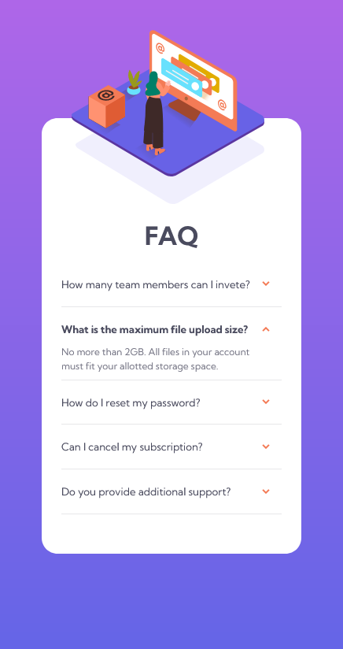

# Frontend Mentor - FAQ accordion card solution

This is a solution to the [FAQ accordion card challenge on Frontend Mentor](https://www.frontendmentor.io/challenges/faq-accordion-card-XlyjD0Oam).

## Table of contents

- [Overview](#overview)
  - [The challenge](#the-challenge)
  - [Screenshot](#screenshot)
  - [Links](#links)
- [My process](#my-process)
  - [Built with](#built-with)
  - [What I learned](#what-i-learned)
  - [Continued development](#continued-development)
- [Author](#author)


## Overview

### The challenge

Users should be able to:

- View the optimal layout for the component depending on their device's screen size
- See hover states for all interactive elements on the page
- Hide/Show the answer to a question when the question is clicked

### Screenshot




### Links

- Solution URL: [https://github.com/Targitay2012/FAQ-accordion-card](https://github.com/Targitay2012/FAQ-accordion-card)
- Live Site URL: [https://targitay2012.github.io/FAQ-accordion-card/](https://targitay2012.github.io/FAQ-accordion-card/)

## My process

### Built with

- Semantic HTML5 markup
- CSS custom properties
- Flexbox
- SCSS
- JQuery

### What I learned

In this challenge, I practiced block-height animation. I learned that transition does not work with height but works with max-height.

```scss
.faq-card__item-text {
  max-height: 0;
  overflow: hidden;
  transition: max-height .5s;

  &.faq-card__item-text--active {
    max-height: 80px;
  }
}
```

### Continued development

I continue to improve in HTML, CSS, JS

## Author

- Frontend Mentor - [@Targitay2012](https://www.frontendmentor.io/profile/Targitay2012)
