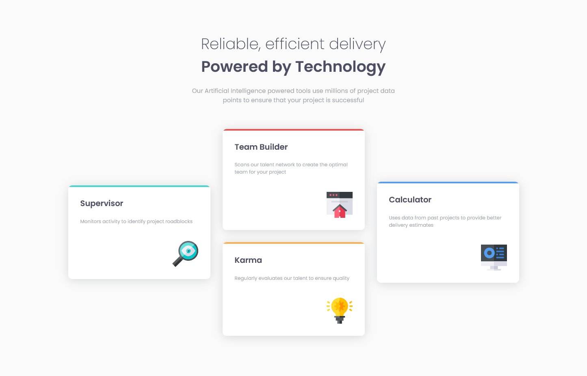
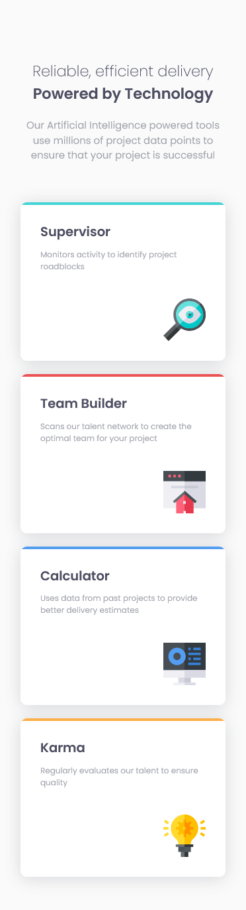

# Frontend Mentor - Four card feature section solution

This is a solution to the [Four card feature section challenge on Frontend Mentor](https://www.frontendmentor.io/challenges/four-card-feature-section-weK1eFYK).

## Table of contents

- [Overview](#overview)
  - [The challenge](#the-challenge)
  - [Screenshot](#screenshot)
  - [Links](#links)
- [My process](#my-process)
  - [Built with](#built-with)
  - [What I learned](#what-i-learned)
  - [Continued development](#continued-development)
  - [Useful resources](#useful-resources)
- [Author](#author)

## Overview

### The challenge

Users should be able to:

- View the optimal layout for the site depending on their device's screen size

### Screenshot




### Links

- Solution URL: [https://github.com/Targitay2012/frontendmentor/tree/main/1.%20Newbie/four-card-feature-section-master](https://github.com/Targitay2012/frontendmentor/tree/main/1.%20Newbie/four-card-feature-section-master)
- Live Site URL: [https://targitay2012.github.io/frontendmentor/1.%20Newbie/four-card-feature-section-master/](https://targitay2012.github.io/frontendmentor/1.%20Newbie/four-card-feature-section-master/)

## My process

### Built with

- Semantic HTML5 markup
- CSS custom properties
- CSS Grid
- SCSS

### What I learned

In this challenge, I practiced a little in using grids.

```html
<ul class="features__grid">
  <li class="features__item">
    <h3 class="features__item-title">
      Supervisor
    </h3>
    <p class="features__item-text">
      Monitors activity to identify project roadblocks
    </p>
  </li>
  <li class="features__item">
    <h3 class="features__item-title">
      Team Builder
    </h3>
    <p class="features__item-text">
      Scans our talent network to create the optimal team for your project
    </p>
  </li>
  <li class="features__item">
    <h3 class="features__item-title">
      Calculator
    </h3>
    <p class="features__item-text">
      Uses data from past projects to provide better delivery estimates
    </p>
  </li>
  <li class="features__item">
    <h3 class="features__item-title">
      Karma
    </h3>
    <p class="features__item-text">
      Regularly evaluates our talent to ensure quality
    </p>
  </li>
</ul>
```
```scss
.features__grid {
  display: grid;
  grid-template-columns: repeat(3, 1fr);
  grid-template-rows: 1fr, 1fr;
  gap: 30px;
  align-items: center;
  text-align: left;
  list-style: none;
  margin: 0;
  padding: 0;
}
```

### Continued development

I continue to improve in HTML, CSS, JS

### Useful resources

- [CSS matic](https://www.cssmatic.com/box-shadow) - This helped me create a box-shadow property.

## Author

- Frontend Mentor - [@Targitay2012](https://www.frontendmentor.io/profile/Targitay2012)