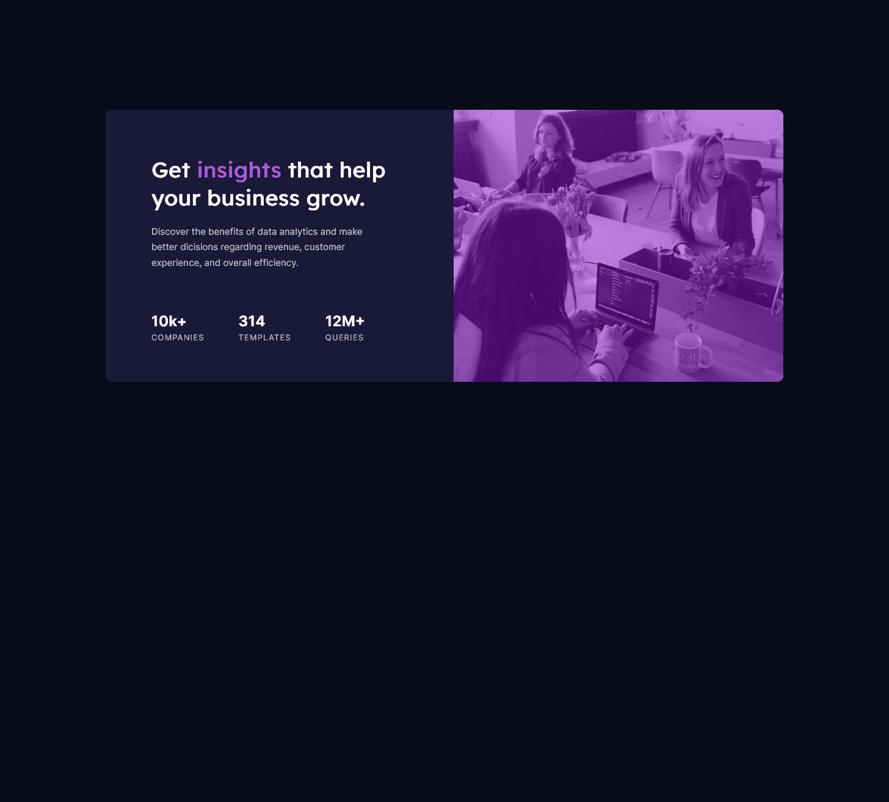

# Frontend Mentor - Stats preview card component solution

This is a solution to the [Stats preview card component challenge on Frontend Mentor](https://www.frontendmentor.io/challenges/stats-preview-card-component-8JqbgoU62).

## Table of contents

- [Overview](#overview)
  - [The challenge](#the-challenge)
  - [Screenshot](#screenshot)
  - [Links](#links)
- [My process](#my-process)
  - [Built with](#built-with)
  - [What I learned](#what-i-learned)
  - [Continued development](#continued-development)
- [Author](#author)

## Overview

### The challenge

Users should be able to:

- View the optimal layout depending on their device's screen size

### Screenshot




### Links

- Solution URL: [https://github.com/Targitay2012/Stats-preview-card-component](https://github.com/Targitay2012/Stats-preview-card-component)
- Live Site URL: [https://targitay2012.github.io/Stats-preview-card-component/](https://targitay2012.github.io/Stats-preview-card-component/)

## My process

### Built with

- Semantic HTML5 markup
- CSS custom properties
- Flexbox

### What I learned

In this challenge I figured out how to stretch the picture so that it fills the entire flex element:

```css
img {
  width: 100%;
  height: 100%;
  object-fit: cover;
}
```

### Continued development

I continue to improve in HTML, CSS, JS

## Author

- Frontend Mentor - [@Targitay2012](https://www.frontendmentor.io/profile/Targitay2012)