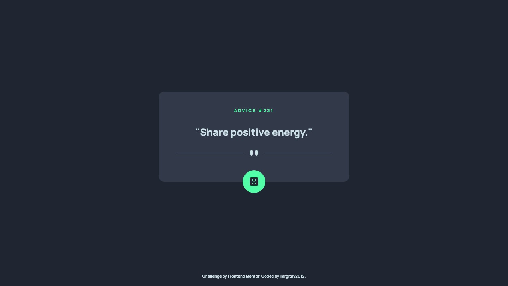
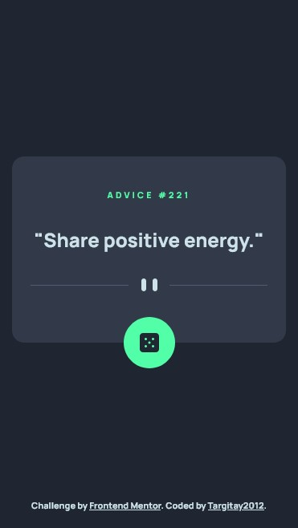

# Frontend Mentor - Advice generator app solution

This is a solution to the [Advice generator app challenge on Frontend Mentor](https://www.frontendmentor.io/challenges/advice-generator-app-QdUG-13db). Frontend Mentor challenges help you improve your coding skills by building realistic projects.

## Table of contents

- [Overview](#overview)
  - [The challenge](#the-challenge)
  - [Screenshot](#screenshot)
  - [Links](#links)
- [My process](#my-process)
  - [Built with](#built-with)
  - [What I learned](#what-i-learned)
  - [Continued development](#continued-development)
  - [Useful resources](#useful-resources)
- [Author](#author)

## Overview

### The challenge

Users should be able to:

- View the optimal layout for the app depending on their device's screen size
- See hover states for all interactive elements on the page
- Generate a new piece of advice by clicking the dice icon

### Screenshot




### Links

- Solution URL: [link](https://github.com/Targitay2012/frontendmentor/tree/main/2.%20Junior/advice-generator-app-main)
- Live Site URL: [link](https://targitay2012.github.io/frontendmentor/2.%20Junior/advice-generator-app-main/)

## My process

### Built with

- Semantic HTML5 markup
- CSS custom properties
- Flexbox
- CSS Grid
- JS, API

### What I learned

In this task, I tried to work with API for the first time. API was a third party.

```js
// getting response from server
let myResponse = await fetch("https://api.adviceslip.com/advice");
// getting a JSON string from the response from the server
let myString = await myResponse.text();
// getting an object from JSON string
let myObject = JSON.parse(myString);
// getting a advice number
let numAdv = myObject.slip["id"];
// getting advice text
let advice = myObject.slip["advice"];
```


### Continued development

I continue to improve in HTML, CSS, JS

### Useful resources

- [w3schools/](https://www.w3schools.com/) - a great reference book with good examples.

## Author

- Frontend Mentor - [@Targitay2012](https://www.frontendmentor.io/profile/Targitay2012)
- Twitter - [@PurboDans](https://www.twitter.com/PurboDans)
