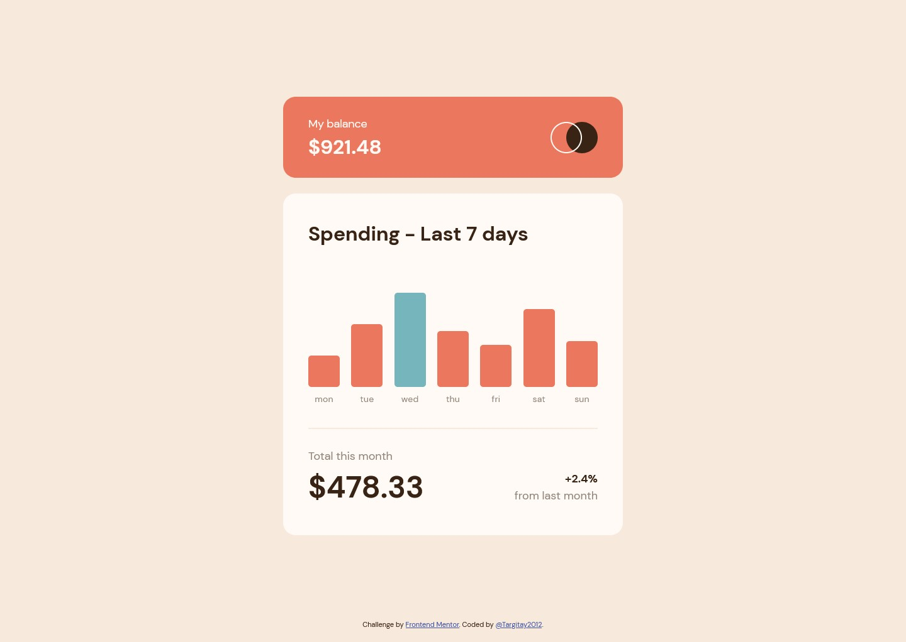
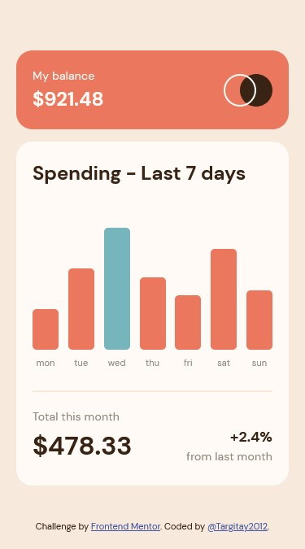

# Frontend Mentor - Expenses chart component solution

This is a solution to the [Expenses chart component challenge on Frontend Mentor](https://www.frontendmentor.io/challenges/expenses-chart-component-e7yJBUdjwt). Frontend Mentor challenges help you improve your coding skills by building realistic projects. 

## Table of contents

- [Overview](#overview)
  - [The challenge](#the-challenge)
  - [Screenshot](#screenshot)
  - [Links](#links)
- [My process](#my-process)
  - [Built with](#built-with)
  - [What I learned](#what-i-learned)
  - [Continued development](#continued-development)
  - [Useful resources](#useful-resources)
- [Author](#author)

**Note: Delete this note and update the table of contents based on what sections you keep.**

## Overview

### The challenge

Users should be able to:

- View the bar chart and hover over the individual bars to see the correct amounts for each day
- See the current day’s bar highlighted in a different colour to the other bars
- View the optimal layout for the content depending on their device’s screen size
- See hover states for all interactive elements on the page
- **Bonus**: Use the JSON data file provided to dynamically size the bars on the chart

### Screenshot




### Links

- Solution URL: [link](https://github.com/Targitay2012/frontendmentor/tree/main/2.%20Junior/expenses-chart-component-main)
- Live Site URL: [link](https://targitay2012.github.io/frontendmentor/2.%20Junior/expenses-chart-component-main/)

## My process

### Built with

- Semantic HTML5 markup
- CSS custom properties
- Flexbox
- JS

### What I learned

Here I learned to read data from a file, and creatJavascriptript object from them.

```js
// get data from file data.json
async function getJSON() {
  const response = await fetch("data.json");
  const json = await response.text();
  return JSON.parse(json);
}

getJSON().then(
  function (myJson) {
    myFun(myJson);
  },
  function (error) {
    alert(error);
  }
)
```

If you want more help with writing markdown, we'd recommend checking out [The Markdown Guide](https://www.markdownguide.org/) to learn more.

**Note: Delete this note and the content within this section and replace with your own learnings.**

### Continued development

I continue to improve in HTML, CSS, JS

### Useful resources

- [w3schools/](https://www.w3schools.com/) - a great reference book with good examples.

## Author

- Frontend Mentor - [@Targitay2012](https://www.frontendmentor.io/profile/Targitay2012)
- Twitter - [@PurboDans](https://www.twitter.com/PurboDans)
