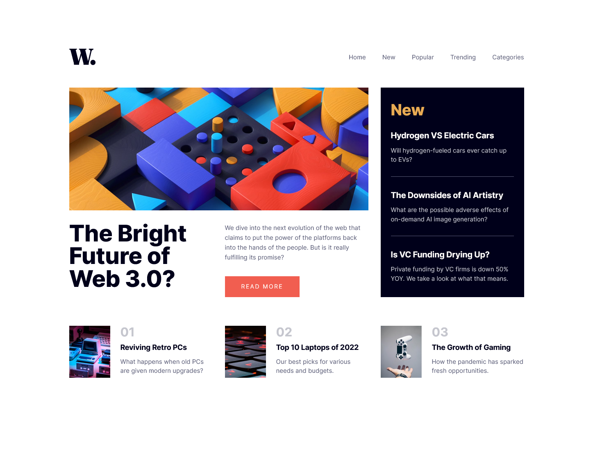
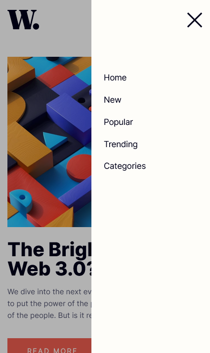

# Frontend Mentor - News homepage solution

This is a solution to the [News homepage challenge on Frontend Mentor](https://www.frontendmentor.io/challenges/news-homepage-H6SWTa1MFl). Frontend Mentor challenges help you improve your coding skills by building realistic projects. 

## Table of contents

- [Overview](#overview)
  - [The challenge](#the-challenge)
  - [Screenshot](#screenshot)
  - [Links](#links)
- [My process](#my-process)
  - [Built with](#built-with)
  - [What I learned](#what-i-learned)
  - [Continued development](#continued-development)
  - [Useful resources](#useful-resources)
- [Author](#author)

## Overview

### The challenge

Users should be able to:

- View the optimal layout for the interface depending on their device's screen size
- See hover and focus states for all interactive elements on the page
- **Bonus**: Toggle the mobile menu (requires some JavaScript)

### Screenshot





### Links

- Solution URL: [link](https://your-solution-url.com)
- Live Site URL: [link](https://your-live-site-url.com)

## My process

### Built with

- Semantic HTML5 markup
- CSS custom properties
- Flexbox
- CSS Grid
- JS

### What I learned

Here practiced creating a modal mobile menu. 

To shade the page under the menu, I add a class to any HTML element and set shading on it in a pseudo-element. He will not let you click on the page except for the menu itself.

```css
.menu {
  position: relative;
  
  &--dark::after {
    content: '';
    position: absolute;
    top: 0;
    left: -15px;
    width: 100vw;
    height: 100vh;
    background-color: rgba(0, 0, 0, .3);
    z-index: 2;
  }
}
```
```js
// get DOM elements
...
const myMenu = document.querySelector(".menu");
...

// modal menu call processing
const handleMenu = () => {
  ...
  myMenuClassList = myMenu.classList;
  ...
  myMenuClassList.toggle("menu--dark");
  ...
 }

menuButton.addEventListener("click", handleMenu);
```

To remove the scroll when the mobile menu is called, I give the body the property `overflow: hidden`.

```js
// get DOM elements
...
const menuList = document.querySelector(".menu__list");
const myBody = document.querySelector("body");
...

// modal menu call processing
const handleMenu = () => {
  menuListClassList = menuList.classList;
  ...
  menuListClassList.toggle("menu__list--active");
  ...
  myBody.style.overflow = "auto";
  ...
  
  // replacing the picture of the menu icon if the menu itself is called
  // and remove the scroll
  if (menuListClassList.contains("menu__list--active")) {
    myBody.style.overflow = "hidden";
    ...
  }
}

menuButton.addEventListener("click", handleMenu);
```

### Continued development

I continue to improve in HTML, CSS, JS

### Useful resources

- [w3schools/](https://www.w3schools.com/) - a great reference book with good examples.


## Author

- Frontend Mentor - [@Targitay2012](https://www.frontendmentor.io/profile/Targitay2012)
- Twitter - [@PurboDans](https://www.twitter.com/PurboDans)
