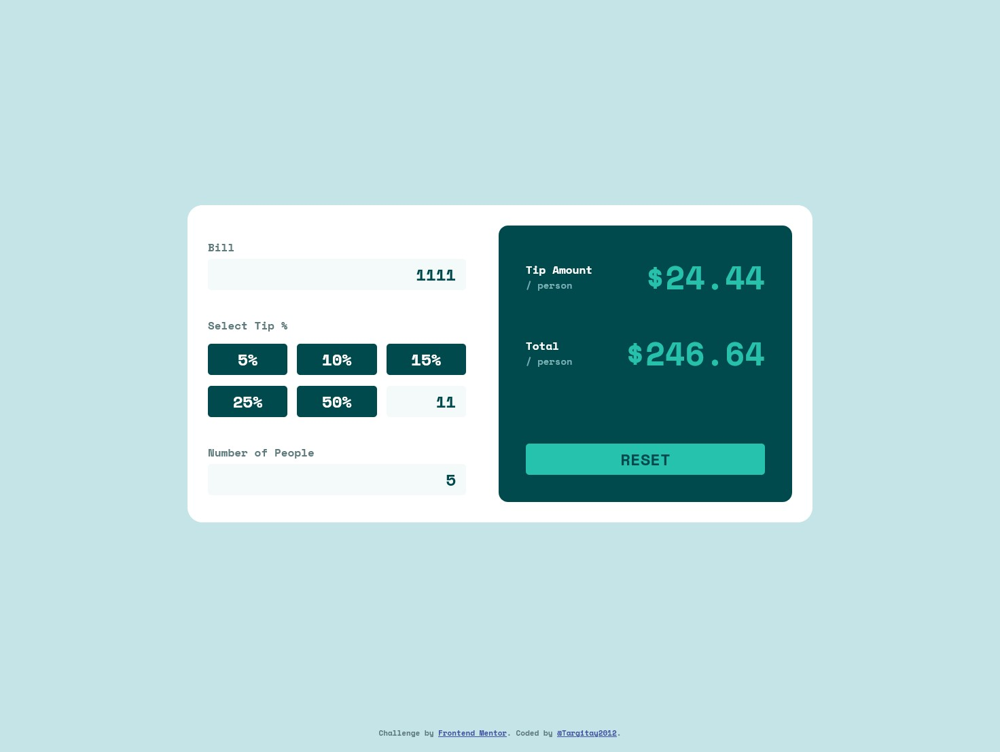
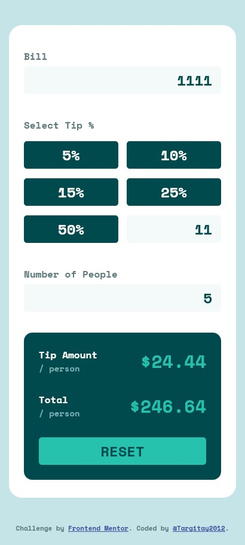

# Frontend Mentor - Tip calculator app solution

This is a solution to the [Tip calculator app challenge on Frontend Mentor](https://www.frontendmentor.io/challenges/tip-calculator-app-ugJNGbJUX). Frontend Mentor challenges help you improve your coding skills by building realistic projects.

## Table of contents

- [Overview](#overview)
  - [The challenge](#the-challenge)
  - [Screenshot](#screenshot)
  - [Links](#links)
- [My process](#my-process)
  - [Built with](#built-with)
  - [What I learned](#what-i-learned)
  - [Continued development](#continued-development)
  - [Useful resources](#useful-resources)
- [Author](#author)

## Overview

### The challenge

Users should be able to:

- View the optimal layout for the app depending on their device's screen size
- See hover states for all interactive elements on the page
- Calculate the correct tip and total cost of the bill per person

### Screenshot




### Links

- Solution URL: [link](https://github.com/Targitay2012/frontendmentor/tree/main/2.%20Junior/tip-calculator-app-main)
- Live Site URL: [link](https://targitay2012.github.io/frontendmentor/2.%20Junior/tip-calculator-app-main/)

## My process

### Built with

- Semantic HTML5 markup
- CSS custom properties
- Flexbox
- CSS Grid
- JS

### What I learned

Deepened my knowledge of the topic of regular expressions a little. I never found a regular expression to remove extra decimal points in the input.

```js
inputBill.addEventListener("input", function () {
	// mask for "bill" field
	this.value = this.value.match(/\d{1,}\.?\d*/);
});

inputCustom.addEventListener("input", function () {
	this.value = this.value.replace(/\D/, "");
	calculateTip(this);
});
```

### Continued development

I continue to improve in HTML, CSS, JS

### Useful resources

- [w3schools](https://www.w3schools.com/) - a great reference book with good examples.

## Author

- Frontend Mentor - [@Targitay2012](https://www.frontendmentor.io/profile/Targitay2012)
- Twitter - [@PurboDans](https://www.twitter.com/PurboDans)
